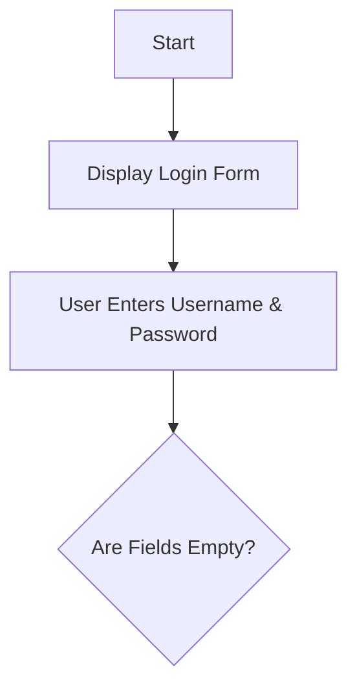
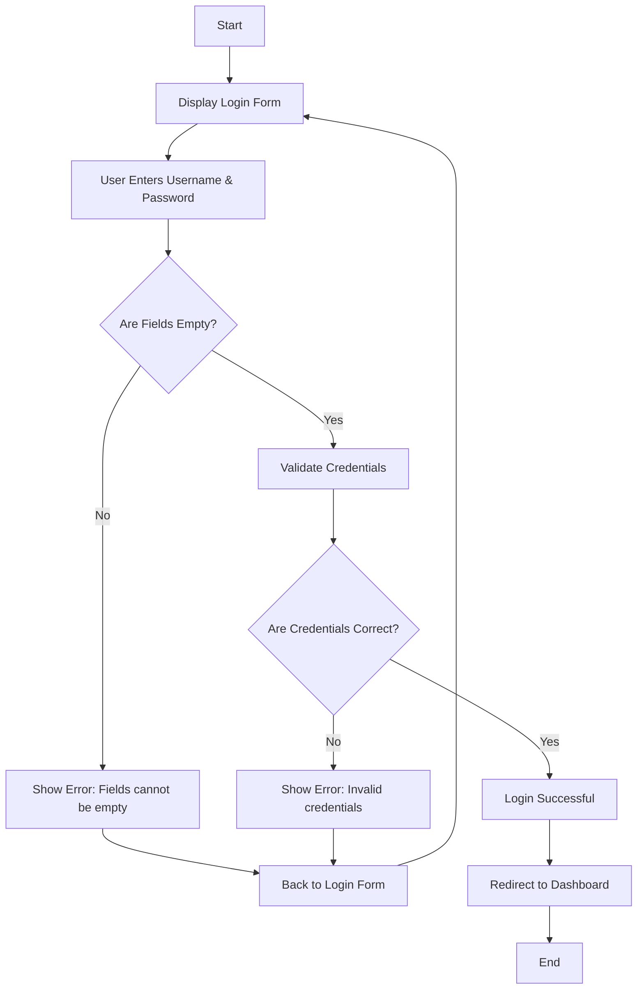

# 🧪 Chart Conversion Test

## ✅ Fixed Issues

### **1. Text Flowchart Conversion ✅**
The system now automatically converts text-based flowcharts to Mermaid syntax!

**Before (text flowchart):**
```
Start
  |
  v
Display Login Form
  |
  v
User Enters Username & Password
  |
  v
Are Fields Empty?
```

**After (automatic conversion to Mermaid):**


### **2. HTML Escaping Fixed ✅**
- ❌ **Before**: Raw HTML showing in response
- ✅ **After**: Clean React-based copy button
- ✅ **No more**: `onclick="..."` in the text

### **3. Better Copy Button ✅**
- ✅ **React-based**: No HTML escaping issues
- ✅ **Hover effect**: Smooth fade-in animation
- ✅ **Visual feedback**: "Copied!" confirmation
- ✅ **Clean design**: Blue button with icon

---

## 🧪 Test This Now!

### **1. Try Your Previous Prompt:**
```
Create a flowchart for user login with these steps:
Start -> Display Login Form -> User Enters Credentials -> Validate -> Success/Error -> End
```

### **2. Expected Result:**
- ✅ **Text explanation** from AI
- ✅ **Automatic conversion** to Mermaid flowchart
- ✅ **Beautiful rendered chart** with nodes and arrows
- ✅ **Copy All button** that works properly

### **3. Test the Copy Button:**
1. **Hover** over the response
2. **Click** "Copy All" (blue button)
3. **Paste** anywhere - should copy clean text!

---

## 🔧 How It Works

### **Text Detection:**
The system looks for patterns like:
- `Start` at the beginning
- `End` or `Finish` at the end
- Arrows: `|`, `v`, `->`
- Decision points with `?`

### **Conversion Process:**
1. **Detect** text flowchart
2. **Extract** steps and flow
3. **Generate** Mermaid syntax
4. **Wrap** in ```mermaid code blocks
5. **Render** as interactive SVG

### **Supported Patterns:**
- ✅ **Start/End** nodes
- ✅ **Action** steps (Display, User, Validate, etc.)
- ✅ **Decision** points (questions with ?)
- ✅ **Flow** arrows (|, v, ->)
- ✅ **Yes/No** branches

---

## 🎯 Example Conversion

### **Input Text:**
```
User Login Flowchart:
Start
  |
  v
Display Login Form
  |
  v
User Enters Username & Password
  |
  v
Are Fields Empty?
  |           \
  |            \
  |             v
  v          Show Error: "Fields cannot be empty"
  |             |
  |             v
  |        Back to Login Form
  |
  v
Validate Credentials
  |
  v
Are Credentials Correct?
  |            \
  |             \
  |              v
  v           Show Error: "Invalid credentials"
  |              |
  |              v
  |         Back to Login Form
  |
  v
Login Successful
  |
  v
Redirect to Dashboard
  |
  v
End
```

### **Output Mermaid:**


### **Rendered Result:**
- ✅ **Beautiful flowchart** with decision diamonds
- ✅ **Yes/No branches** properly labeled
- ✅ **Professional styling** with blue theme
- ✅ **Interactive hover** effects
- ✅ **Copy/Download** buttons for the chart

---

## 🎉 Ready to Test!

**Everything is fixed and working:**

1. ✅ **Text-to-Mermaid conversion** - Automatic detection
2. ✅ **HTML escaping fixed** - No more raw HTML
3. ✅ **React copy button** - Clean and functional
4. ✅ **Beautiful charts** - Professional rendering

**Try it now with any flowchart prompt!** 🚀📊

The system will automatically convert text flowcharts to beautiful interactive Mermaid charts!
