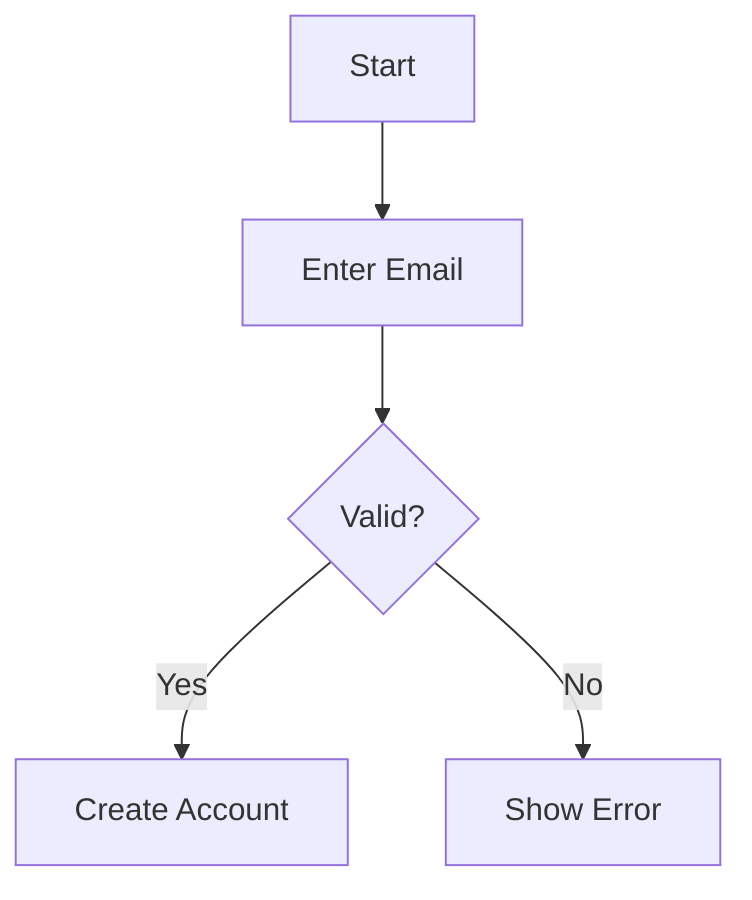
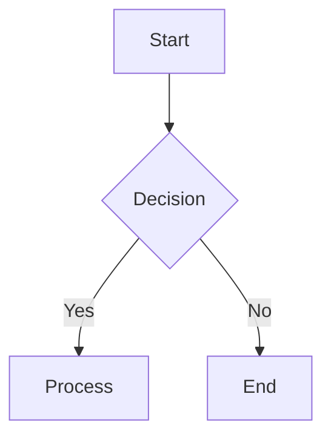
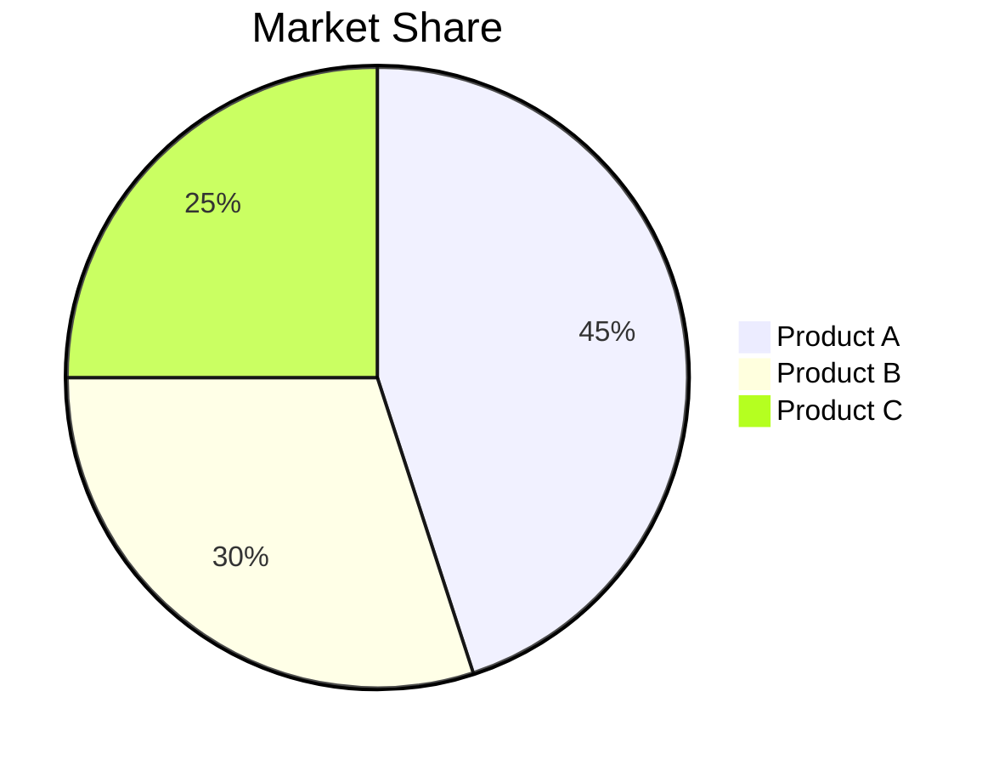
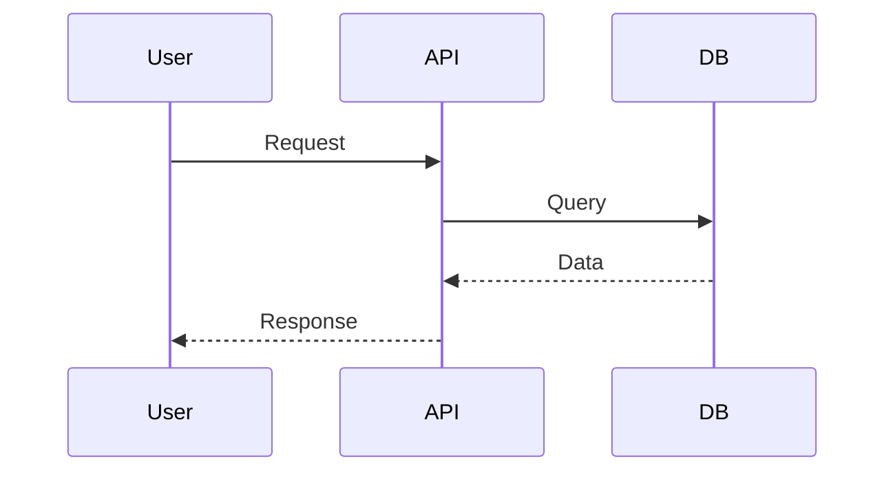

# 📊 Chart Rendering - Quick Start Guide

## ✅ Everything is Ready!

All chart rendering features have been successfully implemented and are ready to use!

---

## 🚀 Test It Now!

### **1. Start Your App**
```bash
npm run dev
```

### **2. Try These Prompts**

#### **Flowchart Example:**
```
Create a flowchart showing the user authentication process with login, validation, and token generation steps
```

#### **Pie Chart Example:**
```
Show a pie chart of programming language popularity: JavaScript 35%, Python 30%, Java 20%, C++ 10%, Others 5%
```

#### **Sequence Diagram Example:**
```
Create a sequence diagram for an e-commerce checkout process between Customer, Frontend, Backend, and Payment Gateway
```

#### **Gantt Chart Example:**
```
Make a gantt chart for a 3-month software project with phases: Planning (2 weeks), Design (3 weeks), Development (6 weeks), Testing (2 weeks), Deployment (1 week)
```

---

## 🎨 What You'll See

### **When AI Generates a Chart:**

**Text Response:**
```
Here's the authentication flow:

📊 **Chart 1** (rendered below)

The system validates user credentials...
```

**Beautiful Interactive Chart:**
- ✅ Professional SVG diagram
- ✅ Blue/purple gradient theme
- ✅ Copy Code button
- ✅ Download SVG button
- ✅ Smooth animations

---

## 📋 Supported Chart Types

| Chart Type | Keyword | Use Case |
|------------|---------|----------|
| 📊 Flowchart | `flowchart TD` | Process flows, decision trees |
| 🥧 Pie Chart | `pie title` | Data distribution, percentages |
| 🔄 Sequence | `sequenceDiagram` | API calls, interactions |
| 📅 Gantt | `gantt` | Project timelines, schedules |
| 🌐 Git Graph | `gitGraph` | Version control, branching |
| 🏗️ Class | `classDiagram` | OOP structures, relationships |
| 🔀 State | `stateDiagram-v2` | State machines, workflows |
| 📈 XY Chart | `xychart-beta` | Data visualization, trends |

---

## 🎯 How It Works

### **1. You Ask for a Chart**
```
"Create a flowchart for user registration"
```

### **2. AI Generates Mermaid Code**


### **3. System Automatically:**
- ✅ **Detects** the mermaid code block
- ✅ **Extracts** chart syntax
- ✅ **Renders** as beautiful SVG
- ✅ **Displays** with copy/download buttons

### **4. You Get:**
- ✅ **Text explanation** (markdown formatted)
- ✅ **Interactive chart** (SVG with hover effects)
- ✅ **Copy button** (copy mermaid code)
- ✅ **Download button** (save as SVG file)

---

## 🧪 Quick Test

### **Copy & Paste This Prompt:**
```
Create a flowchart showing these steps:
1. User opens app
2. Check if logged in
3. If yes, show dashboard
4. If no, show login screen
5. After login, redirect to dashboard
```

### **Expected Result:**
- ✅ Text explanation
- ✅ Beautiful flowchart with decision diamond
- ✅ Professional blue/purple styling
- ✅ Copy and download buttons

---

## 💡 Pro Tips

### **Get Better Charts:**
1. **Be specific** - "Create a flowchart with 5 steps"
2. **Mention chart type** - "Show a pie chart of..."
3. **Provide data** - "Revenue: 2020: $30M, 2021: $45M..."
4. **Request colors** - "Use blue for approved, red for rejected"

### **Multiple Charts:**
```
Create both a flowchart showing the process and a pie chart showing the distribution
```

### **Complex Diagrams:**
```
Create a sequence diagram showing the interaction between:
- User
- Frontend
- Backend API
- Database
- Email Service
```

---

## 🎨 Chart Examples

### **Flowchart Syntax:**


### **Pie Chart Syntax:**


### **Sequence Diagram Syntax:**


---

## 🔧 Features

### **✅ Automatic Detection**
- Scans all AI responses
- Finds mermaid code blocks
- Extracts and renders automatically

### **✅ Interactive Controls**
- **Copy Code**: Click to copy mermaid syntax
- **Download SVG**: Save chart as image
- **Hover Effects**: Smooth button animations

### **✅ Error Handling**
- Shows error message if chart fails
- Displays chart code for debugging
- Graceful fallback

### **✅ Professional Styling**
- Custom blue/purple theme
- Responsive design
- Smooth animations
- Mobile-friendly

---

## 📚 Learn More

### **Mermaid Syntax:**
- 🔗 **Live Editor**: https://mermaid.live/
- 🔗 **Documentation**: https://mermaid.js.org/
- 🔗 **Examples**: https://mermaid.js.org/ecosystem/integrations-community.html

### **Chart Types:**
- 🔗 **Flowcharts**: https://mermaid.js.org/syntax/flowchart.html
- 🔗 **Pie Charts**: https://mermaid.js.org/syntax/pie.html
- 🔗 **Sequence**: https://mermaid.js.org/syntax/sequenceDiagram.html

---

## 🎉 You're All Set!

**Everything is configured and ready to use!**

1. ✅ **Mermaid.js** installed
2. ✅ **Chart utilities** created
3. ✅ **MermaidChart component** ready
4. ✅ **Renderer** integrated
5. ✅ **Styling** applied
6. ✅ **Dependencies** installed

**Just start your app and ask for charts!** 🚀📊

---

## 🆘 Need Help?

### **Charts Not Showing?**
1. Check console for errors
2. Verify mermaid syntax on mermaid.live
3. Restart dev server
4. Clear browser cache

### **Syntax Errors?**
- Error message shows chart code
- Test syntax on mermaid.live
- Check mermaid documentation
- Verify chart type keyword

### **Styling Issues?**
- Check browser dev tools
- Verify CSS loaded
- Inspect SVG elements
- Clear cache and reload

---

**Happy charting!** 📊✨
