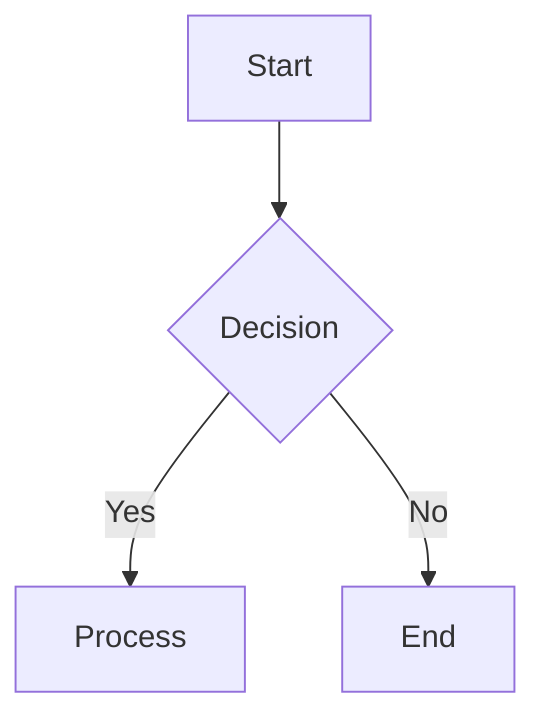
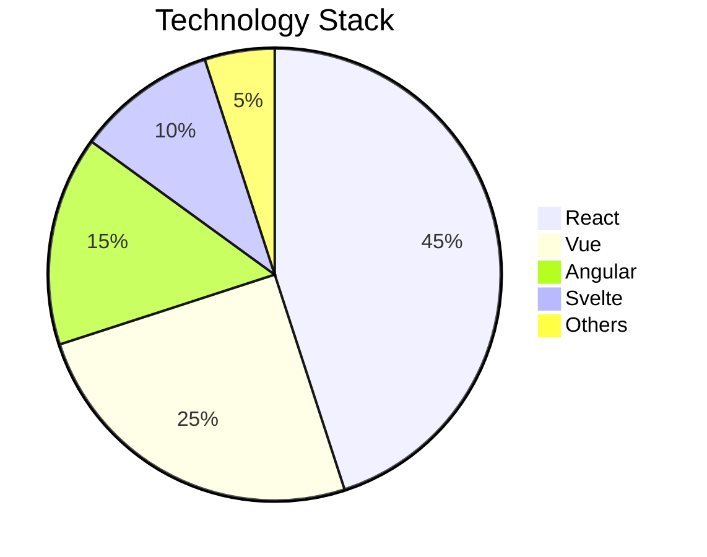
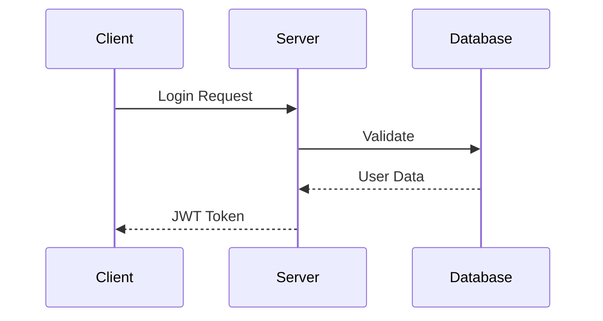
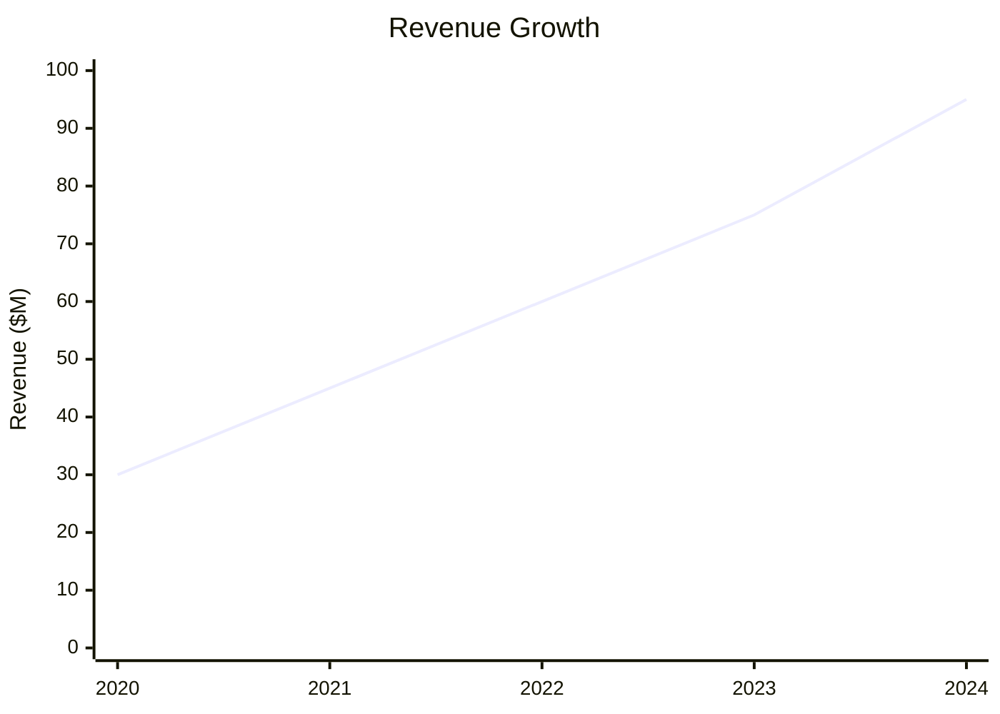
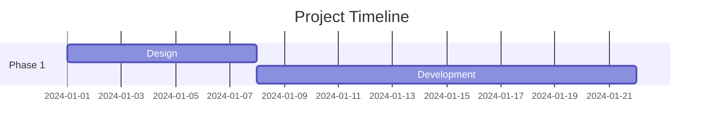
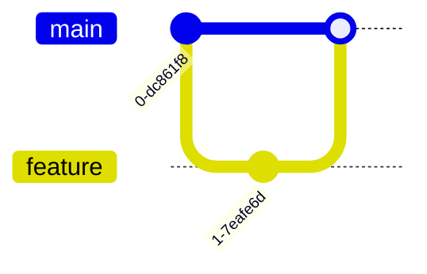
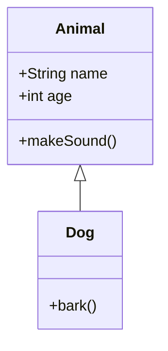
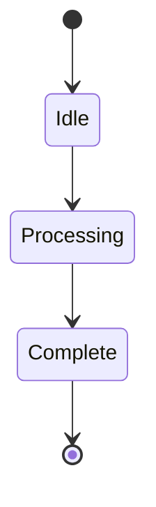
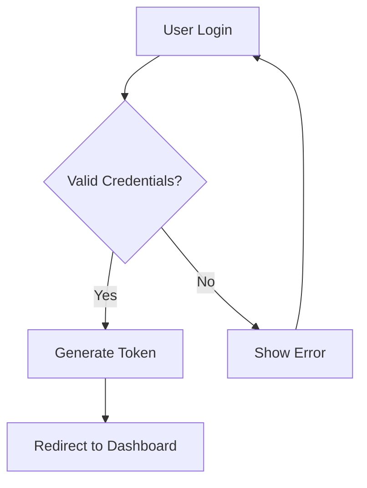

# 🎉 Mermaid Chart Rendering - Complete Implementation!

## ✅ What's Been Implemented

### **1. Mermaid.js Integration ✅**
- ✅ **Library**: Mermaid v11.4.0 added to dependencies
- ✅ **Auto-detection**: Automatically finds charts in AI responses
- ✅ **Separation**: Charts rendered separately from text
- ✅ **Professional**: Beautiful SVG-based interactive charts

### **2. Chart Detection System ✅**
- ✅ **Utility functions**: `extractMermaidCharts()`, `hasCharts()`, `getChartType()`
- ✅ **Multiple patterns**: Detects ```mermaid blocks and standalone syntax
- ✅ **Smart extraction**: Removes charts from text, adds placeholders
- ✅ **Type detection**: Identifies flowcharts, pie charts, sequences, etc.

### **3. MermaidChart Component ✅**
- ✅ **Interactive rendering**: Converts text to beautiful SVG
- ✅ **Copy button**: Copy chart code to clipboard
- ✅ **Download button**: Save charts as SVG files
- ✅ **Error handling**: Graceful fallback with error messages
- ✅ **Loading states**: Visual feedback during rendering

### **4. Enhanced Renderer Integration ✅**
- ✅ **Automatic detection**: Scans all AI responses for charts
- ✅ **Separate rendering**: Charts displayed after text content
- ✅ **Numbered charts**: "Chart 1", "Chart 2", etc.
- ✅ **Copy buttons**: Still works for text, code, and tables

### **5. Professional Styling ✅**
- ✅ **Custom theme**: Blue/purple gradient color scheme
- ✅ **Responsive**: Mobile-friendly chart sizing
- ✅ **Animations**: Smooth fade-in effects
- ✅ **Hover effects**: Interactive button states
- ✅ **Chart-specific**: Tailored styles for each chart type

---

## 📦 Files Created/Modified

### **New Files:**
```
src/lib/chart-utils.ts          - Chart detection and extraction utilities
src/components/MermaidChart.tsx - Mermaid chart rendering component
```

### **Modified Files:**
```
package.json                                    - Added mermaid dependency
src/components/EnhancedMarkdownRenderer.tsx    - Integrated chart support
src/index.css                                   - Added chart styling
```

---

## 🎨 Supported Chart Types

### **📊 Flowcharts**


### **🥧 Pie Charts**


### **🔄 Sequence Diagrams**


### **📈 XY Charts**


### **📅 Gantt Charts**


### **🌐 Git Graphs**


### **🏗️ Class Diagrams**


### **🔀 State Diagrams**


---

## 🚀 How It Works

### **1. AI Generates Response with Chart**
```
User: "Create a flowchart for user authentication"

Claude: "Here's the authentication flow:



The system validates credentials and generates a JWT token..."
```

### **2. System Detects Chart**
- ✅ **Regex scan**: Finds ```mermaid...``` blocks
- ✅ **Extract code**: Pulls out chart syntax
- ✅ **Replace**: Adds placeholder "📊 **Chart 1** (rendered below)"
- ✅ **Store**: Saves chart code for rendering

### **3. Separate Rendering**
- ✅ **Text content**: Rendered with marked.js (markdown)
- ✅ **Chart code**: Rendered with Mermaid.js (SVG)
- ✅ **Combined display**: Text first, then charts

### **4. Interactive Features**
- ✅ **Copy Code**: Click to copy mermaid syntax
- ✅ **Download SVG**: Save chart as image file
- ✅ **Hover effects**: Smooth button animations
- ✅ **Error handling**: Shows code if rendering fails

---

## 🧪 Test Examples

### **Test 1: Flowchart**
**Prompt:**
```
Create a flowchart showing the software development lifecycle
```

**Expected Result:**
- ✅ Text explanation
- ✅ Beautiful flowchart with nodes and arrows
- ✅ Copy and download buttons
- ✅ Professional blue/purple theme

### **Test 2: Pie Chart**
**Prompt:**
```
Show a pie chart of market share: React 45%, Vue 25%, Angular 15%, Svelte 10%, Others 5%
```

**Expected Result:**
- ✅ Colorful pie chart
- ✅ Labeled segments
- ✅ Title "Market Share"
- ✅ Interactive hover effects

### **Test 3: Sequence Diagram**
**Prompt:**
```
Create a sequence diagram for API authentication flow
```

**Expected Result:**
- ✅ Actor boxes (Client, Server, Database)
- ✅ Message arrows with labels
- ✅ Professional layout
- ✅ Clear interaction flow

### **Test 4: Multiple Charts**
**Prompt:**
```
Show both a flowchart and a pie chart for project planning
```

**Expected Result:**
- ✅ Chart 1: Flowchart
- ✅ Chart 2: Pie chart
- ✅ Both numbered and separated
- ✅ Individual copy/download buttons

---

## 🎯 Features Summary

### **✅ Automatic Detection**
- **Scans all AI responses** for mermaid syntax
- **Multiple pattern matching** (code blocks, standalone)
- **Smart extraction** without breaking text flow
- **Type identification** for proper rendering

### **✅ Professional Rendering**
- **SVG-based charts** (scalable, high-quality)
- **Custom theme** (blue/purple gradient)
- **Responsive design** (mobile-friendly)
- **Smooth animations** (fade-in effects)

### **✅ Interactive Controls**
- **Copy button** (copy mermaid code)
- **Download button** (save as SVG)
- **Hover effects** (smooth transitions)
- **Error fallback** (shows code if fails)

### **✅ Developer Experience**
- **Zero configuration** (works out of the box)
- **TypeScript support** (full type safety)
- **Extensible** (easy to add chart types)
- **Well-documented** (clear code comments)

---

## 📋 Installation Required

**Before testing, run:**
```bash
npm install
```

This will install:
- ✅ `mermaid@^11.4.0` - Chart rendering library
- ✅ All other dependencies

---

## 🎨 Customization

### **Change Chart Theme**
Edit `src/components/MermaidChart.tsx`:
```typescript
mermaid.initialize({
  theme: 'default', // or 'dark', 'forest', 'neutral'
  themeVariables: {
    primaryColor: '#3b82f6',    // Change primary color
    secondaryColor: '#8b5cf6',  // Change secondary color
    // ... more customization
  },
});
```

### **Add Custom Chart Types**
Edit `src/lib/chart-utils.ts`:
```typescript
export function getChartType(chartCode: string): string {
  // Add your custom chart type detection
  if (firstLine.startsWith('mychart')) return 'mychart';
  // ...
}
```

### **Modify Chart Styling**
Edit `src/index.css`:
```css
/* Customize chart appearance */
.mermaid-chart-content svg {
  /* Your custom styles */
}
```

---

## 🔧 Troubleshooting

### **Charts Not Rendering?**
1. ✅ **Run `npm install`** to install mermaid
2. ✅ **Check console** for errors
3. ✅ **Verify syntax** - use mermaid live editor
4. ✅ **Restart dev server** after install

### **Chart Syntax Errors?**
- ✅ **Error message shown** with chart code
- ✅ **Click "Show chart code"** to see syntax
- ✅ **Test on mermaid.live** to validate
- ✅ **Check mermaid docs** for correct syntax

### **Styling Issues?**
- ✅ **Clear browser cache**
- ✅ **Check CSS loaded** in dev tools
- ✅ **Verify Tailwind** is working
- ✅ **Inspect SVG elements** for styling

---

## 📚 Resources

### **Mermaid Documentation:**
- 🔗 **Official Docs**: https://mermaid.js.org/
- 🔗 **Live Editor**: https://mermaid.live/
- 🔗 **Syntax Guide**: https://mermaid.js.org/intro/syntax-reference.html
- 🔗 **Examples**: https://mermaid.js.org/ecosystem/integrations-community.html

### **Chart Types:**
- 🔗 **Flowcharts**: https://mermaid.js.org/syntax/flowchart.html
- 🔗 **Sequence**: https://mermaid.js.org/syntax/sequenceDiagram.html
- 🔗 **Gantt**: https://mermaid.js.org/syntax/gantt.html
- 🔗 **Pie**: https://mermaid.js.org/syntax/pie.html
- 🔗 **Git Graph**: https://mermaid.js.org/syntax/gitgraph.html

---

## 🎉 Ready to Use!

### **Quick Start:**
1. **Run** `npm install`
2. **Start** dev server: `npm run dev`
3. **Generate** response with chart
4. **See** beautiful interactive charts!

### **Test Prompts:**
```
1. "Create a flowchart for user registration"
2. "Show a pie chart of technology adoption"
3. "Draw a sequence diagram for API calls"
4. "Make a gantt chart for project timeline"
5. "Create a git graph showing branching strategy"
```

---

## 🎯 What You Get

### **🎨 Beautiful Charts**
- ✅ **Professional appearance** with custom theme
- ✅ **Interactive SVG** with hover effects
- ✅ **Responsive design** for all screen sizes
- ✅ **Smooth animations** for better UX

### **⚡ Smart Detection**
- ✅ **Automatic extraction** from AI responses
- ✅ **Multiple patterns** supported
- ✅ **Clean separation** from text content
- ✅ **Type identification** for proper rendering

### **🔧 Developer Friendly**
- ✅ **TypeScript support** with full types
- ✅ **Well-documented** code
- ✅ **Easy customization** via config
- ✅ **Extensible architecture** for new features

### **📊 All Chart Types**
- ✅ **Flowcharts** - Process flows
- ✅ **Pie Charts** - Data distribution
- ✅ **Sequence Diagrams** - Interactions
- ✅ **Gantt Charts** - Timelines
- ✅ **Git Graphs** - Version control
- ✅ **Class Diagrams** - OOP structures
- ✅ **State Diagrams** - State machines
- ✅ **XY Charts** - Data visualization

---

**Mermaid chart rendering fully integrated!** 🚀✨

Your OneMindAI now automatically detects and renders professional charts from all AI responses!

Run `npm install` and start testing with chart prompts! 📊🎉
