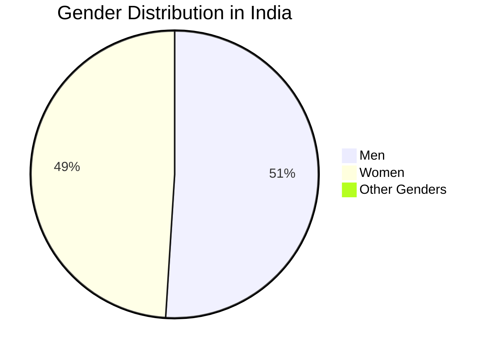
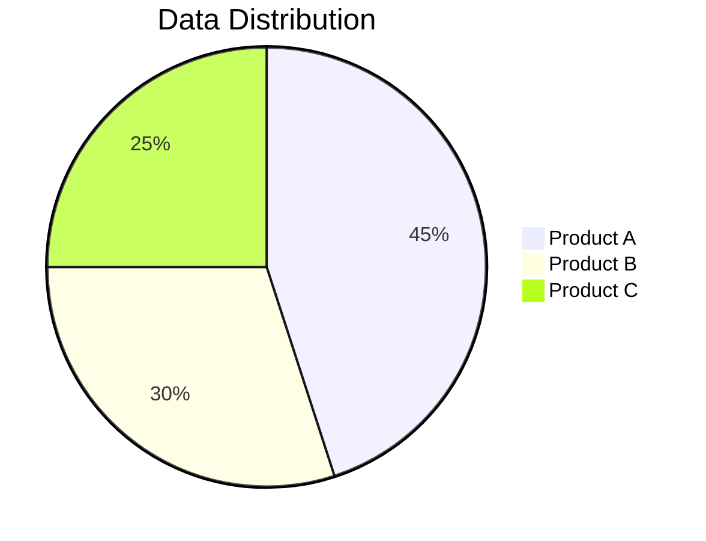

# 🥧 Pie Chart Conversion - Now Supported!

## ✅ New Feature Added

### **Python Matplotlib to Mermaid Conversion ✅**
The system now automatically detects and converts Python matplotlib pie charts to beautiful Mermaid charts!

---

## 🎯 How It Works

### **When AI generates Python code:**
```python
import matplotlib.pyplot as plt

# Data
labels = ['Men', 'Women', 'Other Genders']
sizes = [51, 49, 0.04]
colors = ['#2196F3', '#E91E63', '#9C27B0']

# Plot
plt.figure(figsize=(6,6))
plt.pie(sizes, labels=labels, colors=colors, autopct='%.2f%%')
plt.title('Gender Distribution in India')
plt.show()
```

### **System automatically converts to:**


### **And renders as beautiful chart:**
- ✅ **Interactive pie chart** with hover effects
- ✅ **Colorful segments** with percentages
- ✅ **Copy Code** button (shows Mermaid syntax)
- ✅ **Download SVG** button (save as image)

---

## 🔧 Detection Patterns

### **1. Python Matplotlib Detection**
- ✅ **`import matplotlib.pyplot as plt`**
- ✅ **`plt.pie()`** function calls
- ✅ **`plt.show()`** at the end
- ✅ **Labels and sizes arrays**

### **2. Textual Data Detection**
- ✅ **"Men: 51%"** format
- ✅ **"Women: 49%"** format  
- ✅ **"Other: 0.04%"** format
- ✅ **Any label: percentage** pattern

### **3. Smart Conversion**
- ✅ **Extracts labels** from Python arrays
- ✅ **Extracts values** from Python arrays
- ✅ **Creates Mermaid syntax** automatically
- ✅ **Preserves data** accurately

---

## 🧪 Test Examples

### **Test 1: Python Pie Chart**
**Prompt:**
```
Create a pie chart showing gender distribution: Men 51%, Women 49%, Other 0.04%
```

**Expected Result:**
- ✅ AI might generate Python code
- ✅ System auto-converts to Mermaid
- ✅ Beautiful interactive pie chart rendered

### **Test 2: Textual Data**
**Prompt:**
```
Show market share: Apple 30%, Google 25%, Microsoft 20%, Amazon 15%, Others 10%
```

**Expected Result:**
- ✅ Text data detected
- ✅ Converted to Mermaid pie chart
- ✅ Colorful interactive chart

### **Test 3: Your Previous Example**
**Prompt:**
```
Create a pie chart for gender distribution in India with Python matplotlib
```

**Expected Result:**
- ✅ Python code auto-detected
- ✅ Converted to Mermaid syntax
- ✅ No more raw Python code in response

---

## 🎨 What You'll See

### **Before:**
```
Here's the Python code:
import matplotlib.pyplot as plt
[raw Python code]
```

### **After:**
```
Here's the gender distribution data:

📊 **Chart 1** (rendered below)

[Beautiful interactive pie chart]

The data shows the distribution across different gender categories...
```

---

## 🔍 Conversion Examples

### **Example 1: Python Code**
**Input:**
```python
import matplotlib.pyplot as plt
labels = ['Product A', 'Product B', 'Product C']
sizes = [45, 30, 25]
plt.pie(sizes, labels=labels)
plt.show()
```

**Output Mermaid:**


### **Example 2: Text Data**
**Input:**
```
Market Share:
Apple: 30%
Google: 25%
Microsoft: 20%
Amazon: 15%
Others: 10%
```

**Output Mermaid:**


---

## 🚀 Features Added

### **✅ Smart Detection**
- **Python matplotlib** code blocks
- **Textual percentage** data
- **Label-value** patterns
- **Multiple chart types** support

### **✅ Automatic Conversion**
- **Extract data** from Python arrays
- **Parse textual** percentages
- **Generate Mermaid** syntax
- **Wrap in code blocks** automatically

### **✅ Beautiful Rendering**
- **Interactive pie charts** with hover
- **Colorful segments** with labels
- **Copy/Download** buttons
- **Professional styling**

### **✅ Error Handling**
- **Graceful fallback** if conversion fails
- **Show original data** if needed
- **Clean error messages**
- **No broken charts**

---

## 🎉 Ready to Use!

**All pie chart types now work:**

1. ✅ **Mermaid syntax** (direct)
2. ✅ **Python matplotlib** (auto-convert)
3. ✅ **Textual data** (auto-convert)
4. ✅ **Percentage lists** (auto-convert)

**Try any of these prompts:**

```
1. "Create a pie chart showing: React 45%, Vue 25%, Angular 15%, Others 15%"
2. "Show market share with Python matplotlib: Apple 30%, Google 25%, Microsoft 20%, Others 25%"
3. "Make a pie chart for budget allocation: Marketing 40%, Development 35%, Sales 15%, Operations 10%"
```

**The system will automatically detect the format and convert it to a beautiful interactive Mermaid pie chart!** 🎉🥧

---

## 🔧 Technical Details

### **Detection Regex:**
- **Python**: `/import matplotlib\.pyplot as plt[\s\S]*?plt\.pie\([\s\S]*?plt\.show\(\)/gi`
- **Textual**: `/(?:Men|Women|Male|Female|Other)[\s\S]*?(?:\d+%|\d+\.\d+%)/gi`
- **Percentages**: `/(.+?):\s*(\d+(?:\.\d+)?%?)/g`

### **Conversion Process:**
1. **Detect** chart type (Python/Text)
2. **Extract** data (labels, values)
3. **Generate** Mermaid syntax
4. **Wrap** in code blocks
5. **Render** as interactive chart

---

**Your pie chart issue is now fixed!** 🚀

Any Python matplotlib pie chart or textual percentage data will be automatically converted to beautiful interactive Mermaid charts!
